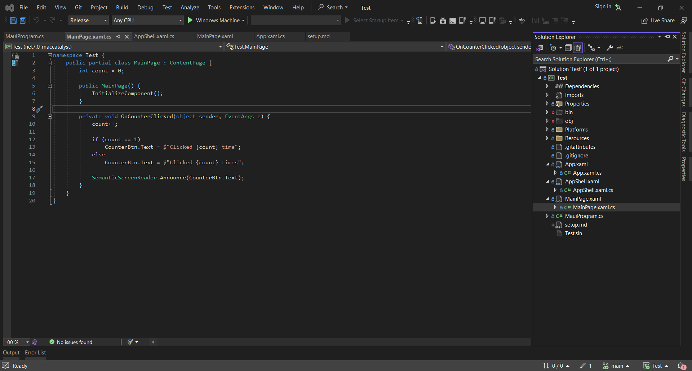

# Setup

The steps outlined below are what I did to set up my personal workspace and a template repository.

1. First requirement is Visual Studio, which I already had installed. I only needed to download the necessary C# package.
1. I created a new project using the MAUI App template.
1. I verified that I can launch the app from Visual Studio and that it works correctly.
    - I tried to also build the app and run the .exe file. But it seems like that is not currently directly supported and the app needs to be signed and packaged first.
    - Following the instructions here https://github.com/dotnet/maui/issues/3166 and applying the changes to the .csproj file, I was able to get the built app to run correctly.
1. I created a GitHub repository.
1. I created a project board for the repository.
1. I created the file `setup.md`, outlining the steps needed to setup a personal working environment.

## Environment configuration

<figcaption align = "center">Fig.1</figcaption>
The template Visual Studio project that is automatically generated when using the MAUI template.

<figcaption align = "center">Fig.2</figcaption>
The running template application. The is the .exe file after the project was build in the Release configuration.

<figcaption align = "center">Fig.3</figcaption>
The GitHub repository with the Visual Studio project.

<figcaption align = "center">Fig.4</figcaption>
The GitHub project board with a test issue from the test repository.

## Reflection

I already had experience with Visual Studio, GitHub, and GUI development so setting up my working environment and a repository was straightforward. There was some strange behaviour where I was not able to run the built application, but after some searching I discovered the solution in the official MAUI GitHub repository, which was explained and linked above.

I will need to revise my C# as it has been quite a while since I used it, and start reading the official documentation and looking at tutorials for MAUI as it will be my first time using it.
