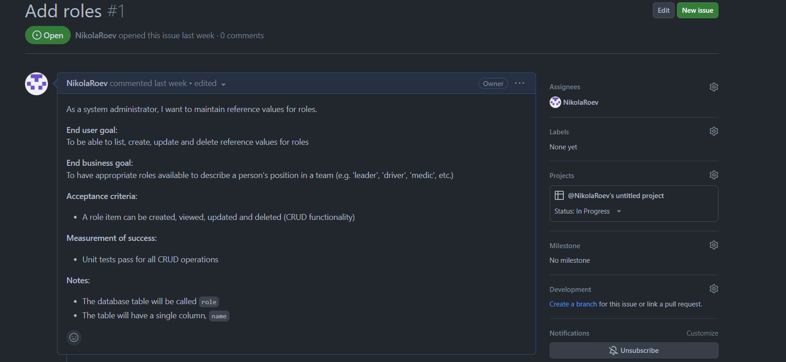
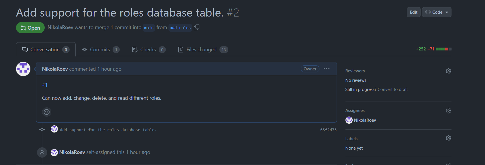
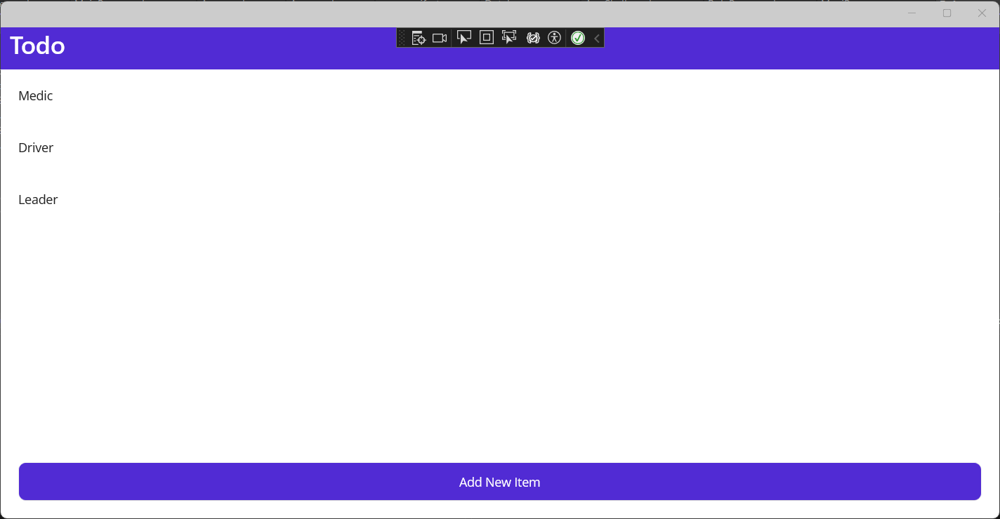
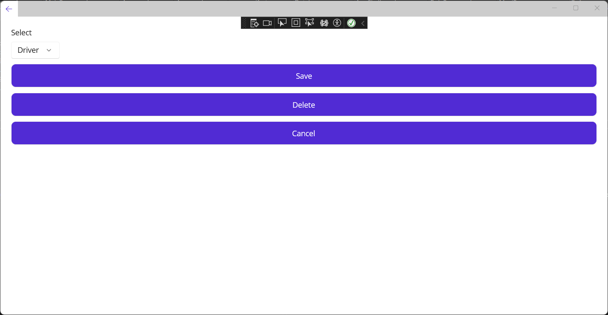
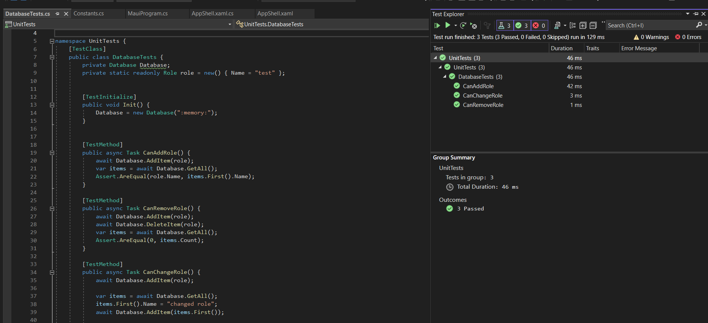

# Workflow

Pull request: https://github.com/NikolaRoev/SET09102-Practicals/pull/2

## Task workflow

<figcaption align = "center">Fig.1</figcaption>
The issue I implemented. I assigned myself to it, moved it to the relevant columns on the project board for each step of development, and linked it in the pull request for clarity and better organisation.

<figcaption align = "center">Fig.2</figcaption>
The pull request on a feauture branch, describing the changes done.

<figcaption align = "center">Fig.3</figcaption>
The main window of the application, showcasing the newly added read functionality for `roles`.

<figcaption align = "center">Fig.4</figcaption>
Secondary window where a role can be added, removed, or updated.

<figcaption align = "center">Fig.5</figcaption>
The tests for the database, all passing.

## Reflection

Unfortunately I was not able to get access to the team repository on time for this submission, but I was able to take part in the overall discussions for our team workflow. I was able to follow what we have outlined when updating a task and the definition of done.

I had some trouble unit testing the database operations. When creating a test project I changed the target framework to Windows, as that is what I am using, and then used an in memory SQLite database as there seems to be an issue accessing the normal location when running for unit tests.
