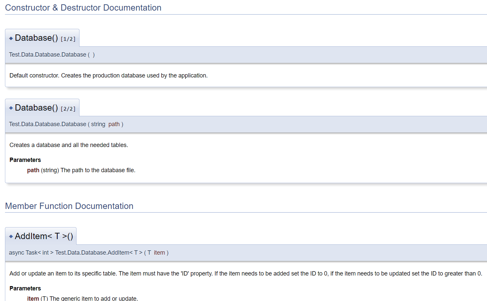

# Documentation

### Clean code:

1. Meaningful names:
    - Names of variables, classes, functions, etc. should be descriptive of the role they play in the overall program. This is helpful when someone else has to read your code, because they will be able to better understand the flow and your intent.
    - As an example: I've used `DatabaseConnection` for the SQLite connection object and `DatabaseFilename` for the name of the SQLite database file.
1. Functions (Do One Thing):
    - Functions should generally accomplish a single objective in a way. Having a function that has multiple side-effects makes the flow of a codebase harder to follow.
    - All the database abstraction functions I have implemented each have a single purpose: add, delete, get.
1. Functions (DRY):
    - Having the same code in multiple places will make it harder to make changes down the line, even if it is sometimes easier to implement.
    - Using generics (`Task<List<T>> GetAll<T>() where T : new()`) the functions in my database class can work with any object.
1. Functions (Small!):
    - The author does not seem to have any better definition than "small==better", but following from the Do On Thing rule, I think the smaller the function is the easier it is to adhere to that. A smaller function is easier to read, reason about, and keep in your head when reading and writing code. Though as all things, it depends.
    - The database class functions I have written are small.
1. Tests (F.I.R.S.T.):
    - The name is quite descriptive, tests should run fast so you don't have to wait a long time to see if a single letter change you've made has had the desired effect. Tests should be indepedent of each other, they are testing a single thing, having complex setup makes it no longer a UNIT test. Repeatable - if your tests fail on one environment you have a failing test not a buggy test. Self-Validating - test should either pass or fail, further details should only be necessary for fixing an issue.
    - All my database unit tests follow these steps.
1. Tests (One Assert per Test):
    - Tests should only validate a single thing. If a unit test needs to assert multiple times, maybe you should split it into two, that makes it easier to see exactly where and how your program fails.
    - Some of my database unit tests follow this.


### Doxygen:

```C#
/*!
 * Default constructor. Creates the production database used by the application.
 */

/*!
 * Creates a database and all the needed tables.
 * @param path (string) The path to the database file.
 */

/*!
 * Add or update an item to its specific table. The item must have the 'ID' property.
 * If the item needs to be added set the ID to 0, if the item needs to be updated set the ID to greater than 0.
 * @param item (T) The generic item to add or update.
 * @return The number of rows updated.
 */
```

#### Added comments

The doxygen comments I have added explain the function of the database class. There are currently two constructors, one is the default constructor used by MAUI when using the database as a global value and passing it to each page, the other is used for the tests so we can construct the database in memory.

The other comment claryfies how to add or update an item generically.



#### Eliminated comments

- The delete and get database functions are small, descriptive, and only do one thing making the need for comments redundant.
- The MAUI pages used in the app are also self-descriptive eliminating the need for any comments.